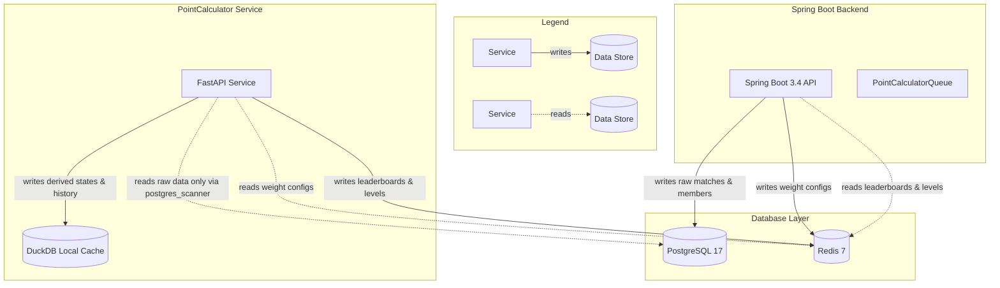
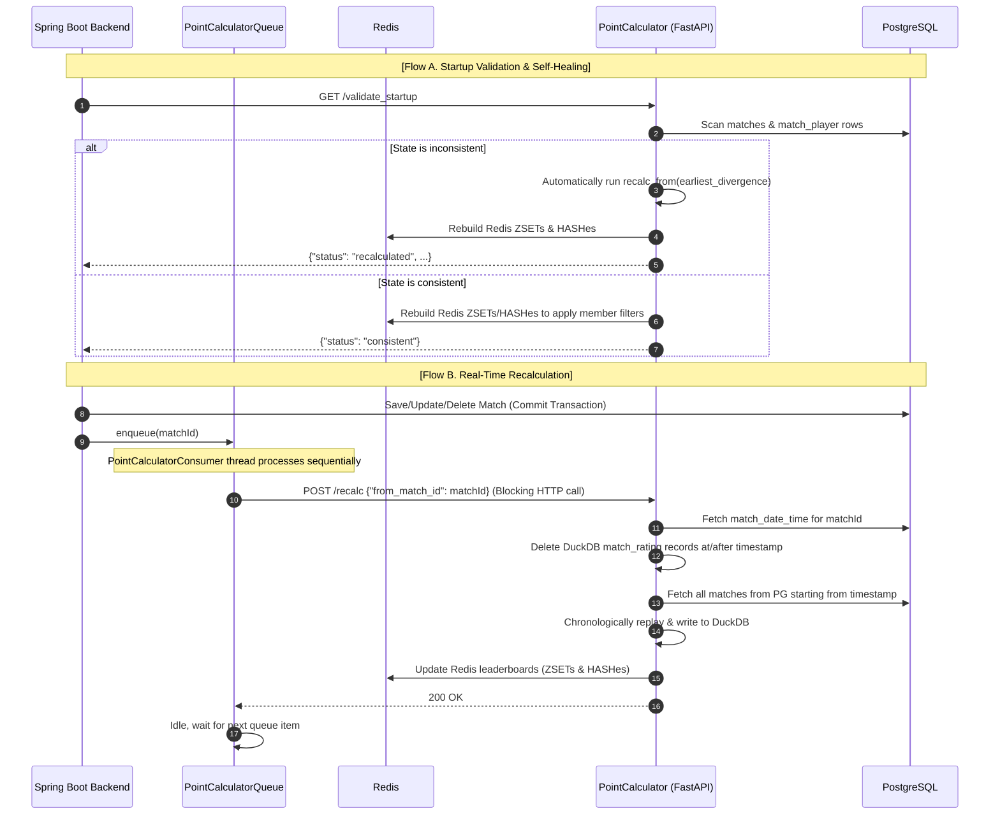

# RV Badminton: Decoupling the Rating Engine

How we split our rating math into a dedicated Python microservice, built an event-replaying cache
with DuckDB, and wired it back to a reactive Spring Boot backend.

<p class="pub-tags"><span class="pub-tag">#fastapi</span> <span class="pub-tag">#spring-boot</span> <span class="pub-tag">#duckdb</span> <span class="pub-tag">#redis</span> <span class="pub-tag">#microservices</span> <span class="pub-tag">#system-design</span></p>

> This is the second post in a series about **RV Badminton** — a production platform I've been building for ~18 months to run a real badminton club. In [Chapter 1](), we mapped out the general layout of the system. Today, we're zooming in on the rating engine: **PointCalculator**, a Python/FastAPI microservice. We'll explore why we extracted it, the authority model that keeps it sane, its internal components, and how it integrates with the Spring Boot backend.

---

## Why the rating engine needed its own home

In [Chapter 1](), I described the ranking system as the thing that made RV Badminton feel competitive. The leaderboard is not a decorative stats page. It decides prize races, gives players a reason to care about one more game, and carries the social trust of the club. If the numbers look arbitrary, late, or impossible to explain, the whole app starts to feel like a black box replacing Sangwoo's old black box.

That made the rating engine a different kind of subsystem from the rest of the backend. The Spring Boot API's main job is to protect facts: who played, when they played, what the score was, which sportsday it belonged to. The rating engine's job is interpretive: given the current rules, what does that history mean?

At first, those two jobs lived together. The rating logic sat directly inside the Java/Spring Boot backend. It was the obvious starting point: a match is saved, you run the math, and you update the database. Simple.

But once real members started using the app, three constraints made that simplicity break down:

1. **Match history is mutable:** In a recreational club, admins fix scores retroactively, delete duplicate matches, or submit games from last Tuesday that they forgot to write down. When a match from a week ago changes, every rating computed *after* that match becomes stale. You can't just apply an incremental patch; you must go back in time to the edited match, clear the derived state, and replay the chronological history forward to the present day.
2. **The rules are a living agreement:** Sangwoo's point system is not a law of nature. It changes when the club learns something: win/loss adjustments feel too harsh, league-level percentile cutoffs need tuning, or social participation should matter more in a given season. Those changes are product decisions, not database facts. They need to be tested, explained, and sometimes backfilled across the full match history.
3. **The results have to be fast and explainable:** Members do not want to wait until the end of the day to see whether the last match moved them up the board. They also need to trust why a number changed. That means the engine needs a reproducible history of derived states, not just a current total overwritten in place.

This is the real reason PointCalculator exists. It was not extracted because microservices are inherently cleaner, or because Python is fashionable for math. It was extracted because the rating logic needed to be **replayable**, **disposable**, and **easy to change**, while the backend needed to remain the stable authority over raw club data.

Python was a practical choice for that boundary. It has strong data tooling, supports fast interactive iteration, and expresses analytical math more naturally than a reactive Java service. But introducing a second language and a new service boundary brings a classic microservice problem: **how do we share state without corrupting it?**

---

## The authority model: Three databases, zero collisions

To prevent our two services from stepping on each other's toes, we established a strict **Authority Model** for our data layers:



Here is the contract:

| Data Item | Source of Truth | Writer | Reader |
|---|---|---|---|
| **Raw Match & Member Data** | PostgreSQL | Spring Boot | PointCalculator |
| **Derived Rating State** | DuckDB | PointCalculator | PointCalculator |
| **Leaderboards & League Levels** | Redis | PointCalculator | Spring Boot |
| **Rating Weights Config** | Redis | Spring Boot (Admin) | PointCalculator |

* **PostgreSQL 17** is the master repository of fact. Only the Spring Boot backend writes to it. PointCalculator treats it as strictly **read-only**, accessing it using DuckDB's fast `postgres_scanner` extension.
* **DuckDB** is an embedded, file-based database (`point_calculator_v2.duckdb`) owned entirely by the PointCalculator service. It stores *only* derived, historical rating calculations. **It is a disposable cache.** If the DuckDB file is deleted or corrupted, PointCalculator simply replays the Postgres match history from scratch to rebuild it.
* **Redis 7** acts as the communication contract between the two services. PointCalculator computes the leaderboards and league levels and pushes them to Redis as Sorted Sets (ZSETs) and Hashes (HASHes). The Spring Boot backend reads directly from Redis to serve the frontend API at lightning speed, never touching Postgres or PointCalculator for leaderboard queries.

---

## Exploring the PointCalculator codebase

The PointCalculator service is structured in a compact, modular package at `PointCalculator/point_calculator`:

```
PointCalculator/
├── Dockerfile
├── requirements.txt
├── run_service.sh
└── point_calculator/
    ├── __init__.py
    ├── main.py              # CLI utility & Uvicorn runner
    ├── api.py               # FastAPI routers & lifecycle management
    ├── config.py            # Environment config parser
    ├── postgres_reader.py   # Read-only scans to PG using DuckDB scanner
    ├── duckdb_store.py      # Schema definitions, updates, & analytical queries
    ├── redis_client.py      # Redis integration for leaderboard writes & locking
    └── rating_engine.py     # Core business logic: MMR, Levels, & Game Points
```

Let’s look at the implementation of the main modules:

### 1. The HTTP Layer: `api.py`
We expose our API via FastAPI. It has a startup lifespan that verifies connections to Postgres and Redis, runs a startup validation check, and handles requests:

* `GET /health`: Basic health checks.
* `POST /recalc`: Triggers recalculation starting from a boundary match ID.
* `GET /validate_startup`: Cross-checks Postgres and DuckDB.
* `GET /get_detailed_gamepoints`: Returns aggregated game points across seasons for valid members.
* `POST /get_sportsday_result`: Returns a snapshot of a leaderboard for a specific sportsday.

### 2. The Analytical Store: `duckdb_store.py`
DuckDB is our local engine for computing and storing derived data. It initializes the database schema if it doesn’t exist:
* `match_rating`: Individual match-by-match player rating history (`lp_before`, `lp_after`, `ll_before`, `ll_after`, `game_points`, `old_game_points`).
* `member_league_state`: The current running rating totals for each member and league type.
* `season_metadata` & `sportsday_metadata`: Caches for season/sportsday mappings.
* `sportsday_points` & `season_points`: Highly aggregated tables used to build game point leaderboards.

For instance, to compute the social-participation weighted points for a sportsday, we run analytical SQL queries directly inside DuckDB:

```python
# From duckdb_store.py
stat.gp_sum * (
    0.5 + 0.6 * (
        (1.0 + CAST(inter.unique_people_count AS DOUBLE)) / CAST(meta.member_count AS DOUBLE)
    )
)
```
This formula rewards members who play with many different opponents during a session instead of stick-in-the-mud duos farming a single court.

### 3. The Core Business Rules: `rating_engine.py`
This is where the magic happens. The `RatingEngine` is responsible for replaying match history and calculating actual scores:

* **Team MMR Weighting:** For double matches, we compute the team's combined rating using a weighted average that prioritizes the lower-rated player:

  ```
  Team MMR = (2 × Lower LP + Higher LP) / 3
  ```

  This prevents a high-ranked player from completely carrying a low-ranked player without any penalty, while keeping team ratings representative.
* **Guest & GG Match Processing:** If any guest player (`GUEST`, `EXGUEST`, `OTHER`) is involved, or the game is marked as a friendly `GG` game, the match is classified as guest-only. It accrues raw Game Points (points played × multiplier) but does **not** alter anyone's competitive League Points (LP) to keep the competitive ladder fair.
* **League Level Percentiles:** Players with ≥ 10 matches in a league are ranked by percentile into levels 1 to 5. Players with fewer than 10 matches are forced to level 6. Level brackets directly impact the Game Point multiplier (e.g., Level 1 gets a 1.60× multiplier down to Level 5 getting 1.15×).

---

## Integration: How Backend & PointCalculator Talk

The interaction between our Spring Boot backend and the PointCalculator service is divided into three key flows:



Let's break down these mechanisms:

### 1. Startup Validation and Self-Healing
When Spring Boot starts up, `PointCalculatorStartupValidator` triggers an asynchronous call to `/validate_startup`.

PointCalculator scans PostgreSQL match records and compares them to its local DuckDB `match_rating` history. If it finds any mismatch (for example, if the backend was running while PointCalculator was offline, or a migration occurred), it calculates the earliest point of divergence and automatically runs a `recalc_from` to heal its database and Redis.

### 2. Sequential Queueing via Spring Boot
To prevent race conditions and file-locking conflicts on the DuckDB file, recalculations must be processed **sequentially**. 

When a match is saved or edited, `MatchService` commits the database transaction and immediately calls `pointCalculatorQueue.enqueue(matchId)`. 

The `PointCalculatorQueue` manages a dedicated background consumer thread (`PointCalculatorConsumer`). It pulls match IDs from a `LinkedBlockingQueue` and makes a synchronous HTTP request to `/recalc`:

```java
// From PointCalculatorQueue.java
try {
    client.triggerRecalculation(matchId).block(); // Synchronously wait for completion
} catch (Exception e) {
    log.error("Error triggering scheduled recalculation for match {}", matchId, e);
}
```
Using `.block()` ensures that the Spring backend waits until PointCalculator finishes updating DuckDB and Redis before dispatching the next request in the queue.

{: .warning }
> **The Match Deletion Limitation:**
> When a match is deleted, Spring Boot removes it from PostgreSQL before enqueuing its ID. Consequently, when PointCalculator receives `/recalc` and tries to look up the timestamp via `pg.fetch_match_datetime(match_id)`, it returns `None`. In version `2.5.0`, this means the recalculation might skip processing. For future iterations, a cleaner approach is passing the timestamp of the deleted match directly in the request body, or scanning for the nearest surrounding match ID to serve as the recomputation boundary.

### 3. Fast Reads with the Redis Contract
Rather than forcing API calls to traverse HTTP bounds to PointCalculator or query Postgres, we leverage a high-performance read path. 

When PointCalculator updates ratings, it writes them to predefined Redis keys. `LeaderboardQueryService` in the Spring backend retrieves results using Redis commands (`ZREVRANGE`, `HGETALL`):

* `leaderboard:men` / `leaderboard:women` / `leaderboard:mixed`: Sorted Sets of member IDs and their competitive LP.
* `leaderboard:gamepoints`: Sorted Set of member IDs and season-weighted Game Points.
* `leaguelevel:men` / `leaguelevel:women` / `leaguelevel:mixed`: Hashes mapping member IDs to their current integer level.

This design gives us sub-millisecond leaderboard reads, keeps Postgres free from heavy analytical queries, and decouples the Java backend from rating formula modifications.

---

## Summary

The PointCalculator architecture demonstrates that microservices do not need to be over-engineered. By defining a clear authority model—with PostgreSQL as the master fact, DuckDB as a disposable replayer, and Redis as the fast caching layer—we achieved the flexibility of Python rating iterations while maintaining the robustness of our reactive Java core.

In the next post, we'll deep-dive into the mathematical mechanics of the MMR adjustments and the season weight decay algorithms. Stay tuned!
