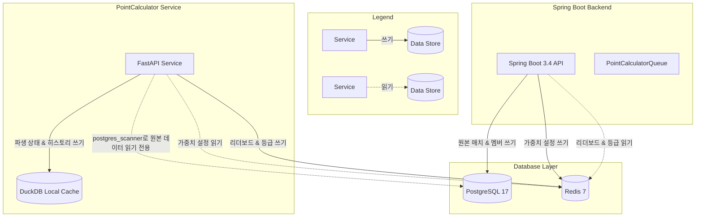
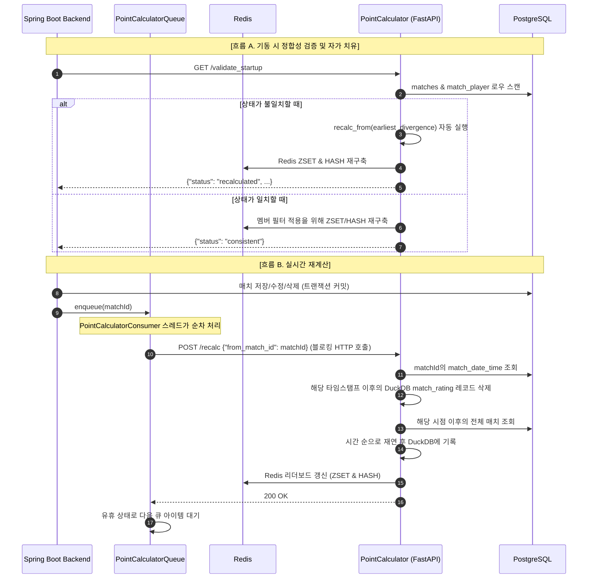

# RV Badminton: 레이팅 엔진 분리하기

레이팅 계산을 전용 Python 마이크로서비스로 분리하고, DuckDB로 이벤트를 재연하는 캐시를 만들고,
이를 다시 리액티브 Spring Boot 백엔드와 연결한 과정.

<p class="pub-tags"><span class="pub-tag">#fastapi</span> <span class="pub-tag">#spring-boot</span> <span class="pub-tag">#duckdb</span> <span class="pub-tag">#redis</span> <span class="pub-tag">#microservices</span> <span class="pub-tag">#system-design</span></p>

> 이 글은 실제 배드민턴 클럽을 위해 약 18개월 동안 만든 프로덕션 플랫폼 **RV Badminton** 시리즈의 두 번째 글이다. [Chapter 1]()에서 전체 구성을 훑었다. 이번에는 Python/FastAPI 마이크로서비스인 **PointCalculator**를 다룬다. 분리한 이유와 데이터 소유권, 내부 구성, Spring Boot 백엔드와의 연결 방식을 설명한다.

---

## 레이팅 엔진에 독립된 집이 필요했던 이유

[Chapter 1]()에서 나는 랭킹 시스템을 RV Badminton을 경쟁적으로 느끼게 만드는 요소로 설명했다. 리더보드는 장식용 통계 페이지가 아니다. 상품 경쟁의 향방을 결정하고, 선수들에게 한 경기를 더 신경 쓸 이유를 주며, 클럽의 사회적 신뢰를 짊어지고 있다. 숫자가 자의적이거나, 늦거나, 설명이 불가능해 보이는 순간 앱 전체가 상우님의 옛 블랙박스를 대체한 또 다른 블랙박스처럼 느껴지기 시작한다.

그래서 레이팅 엔진은 백엔드의 나머지 부분과는 다른 종류의 서브시스템이었다. Spring Boot API의 주된 임무는 사실을 지키는 것이다. 누가 쳤고, 언제 쳤고, 점수가 몇이었고, 어느 스포츠데이에 속하는지 말이다. 반면 레이팅 엔진의 임무는 해석적이다. 현재의 규칙 아래에서 그 히스토리가 무엇을 의미하는가를 다룬다.

처음에는 이 두 임무가 한곳에 살았다. 레이팅 로직이 Java/Spring Boot 백엔드 안에 직접 들어 있었다. 당연한 출발점이었다. 매치가 저장되면 계산을 돌리고 데이터베이스를 갱신한다. 단순하다.

하지만 실제 회원들이 앱을 쓰기 시작하자 세 가지 제약이 그 단순함을 무너뜨렸다.

1. **매치 히스토리는 가변적이다:** 동호회에서는 관리자가 점수를 소급해 수정하거나, 중복 매치를 삭제하거나, 지난주 화요일에 적어두는 걸 잊은 경기를 뒤늦게 입력하는 일이 일어난다. 일주일 전 매치가 바뀌면 그 매치 *이후*에 계산된 모든 레이팅이 낡은 값이 된다. 증분 패치를 적용하는 것으로는 해결되지 않는다. 수정된 매치 시점으로 돌아가 파생 상태를 지우고, 현재까지의 히스토리를 시간 순으로 재연해야 한다.
2. **규칙은 살아 있는 합의다:** 상우님의 점수 체계는 자연법칙이 아니다. 클럽이 무언가를 배울 때마다 바뀐다. 승패 보정이 너무 가혹하게 느껴지거나, 리그 레벨 백분위 커트라인을 조정해야 하거나, 특정 시즌에는 사교 참여도가 더 중요해져야 하는 식이다. 이런 변화는 데이터베이스의 사실이 아니라 제품 결정이다. 테스트되고, 설명되고, 때로는 전체 매치 히스토리에 소급 적용되어야 한다.
3. **결과는 빠르고 설명 가능해야 한다:** 회원들은 방금 친 매치가 자신의 순위를 올렸는지 알기 위해 하루가 끝날 때까지 기다리고 싶어 하지 않는다. 또한 숫자가 왜 바뀌었는지 신뢰할 수 있어야 한다. 그러려면 엔진에는 제자리에서 덮어써지는 현재 합계가 아니라, 재현 가능한 파생 상태의 히스토리가 필요하다.

PointCalculator를 분리한 이유는 여기에 있다. 마이크로서비스가 더 멋져서가 아니라, 레이팅 로직은 **재연 가능하고(replayable)**, **버릴 수 있고(disposable)**, **바꾸기 쉬워야** 했다. 반면 백엔드는 원본 클럽 데이터의 안정적인 권위자로 남아야 했다.

이 경계에서 Python은 실용적인 선택이었다. 데이터 처리 도구가 잘 갖춰져 있고, 분석 계산을 리액티브 Java 서비스보다 간결하게 표현할 수 있다. 대신 언어와 서비스가 하나 더 늘어나면 익숙한 문제가 생긴다. **상태를 오염시키지 않고 어떻게 공유할 것인가?**

---

## 권한 모델: 세 개의 데이터베이스, 충돌 없음

두 서비스가 같은 데이터를 제각각 바꾸지 않도록, 데이터 계층별 **권한 모델(Authority Model)**을 정했다.



계약은 다음과 같다.

| 데이터 항목 | 신뢰의 원천 (Source of Truth) | 쓰기 주체 (Writer) | 읽기 주체 (Reader) |
|---|---|---|---|
| **원본 매치 & 멤버 데이터** | PostgreSQL | Spring Boot | PointCalculator |
| **파생된 레이팅 상태** | DuckDB | PointCalculator | PointCalculator |
| **리더보드 & 리그 등급** | Redis | PointCalculator | Spring Boot |
| **레이팅 가중치 설정** | Redis | Spring Boot (어드민) | PointCalculator |

* **PostgreSQL 17**은 원본 데이터 저장소다. Spring Boot 백엔드만 쓰고, PointCalculator는 DuckDB의 `postgres_scanner` 익스텐션으로 읽기만 한다.
* **DuckDB**는 PointCalculator가 소유하는 임베디드 파일 기반 데이터베이스(`point_calculator_v2.duckdb`)다. 매치별 레이팅 계산 결과처럼 파생된 데이터만 저장한다. 파일이 삭제되거나 손상돼도 PostgreSQL의 매치 히스토리를 재연해 다시 만들 수 있다.
* **Redis 7**은 두 서비스가 주고받는 결과의 저장소다. PointCalculator가 리더보드와 리그 등급을 Sorted Set(ZSET)과 Hash(HASH)로 쓰면 Spring Boot 백엔드는 이를 직접 읽어 API로 보낸다.

---

## PointCalculator 코드베이스 살펴보기

PointCalculator 서비스는 `PointCalculator/point_calculator` 아래의 작은 모듈식 패키지로 구성되어 있다.

```
PointCalculator/
├── Dockerfile
├── requirements.txt
├── run_service.sh
└── point_calculator/
    ├── __init__.py
    ├── main.py              # CLI utility & Uvicorn runner
    ├── api.py               # FastAPI routers & lifecycle management
    ├── config.py            # Environment config parser
    ├── postgres_reader.py   # Read-only scans to PG using DuckDB scanner
    ├── duckdb_store.py      # Schema definitions, updates, & analytical queries
    ├── redis_client.py      # Redis integration for leaderboard writes & locking
    └── rating_engine.py     # Core business logic: MMR, Levels, & Game Points
```

주요 모듈을 살펴보자.

### 1. HTTP 계층: `api.py`
API는 FastAPI로 노출한다. 시작 시 lifespan에서 PostgreSQL과 Redis 연결을 확인하고, 기동 정합성 검증을 실행한 뒤 요청을 처리한다.

* `GET /health`: 기본 헬스 체크.
* `POST /recalc`: 경계가 되는 매치 ID를 기준으로 그 시점부터 재계산을 트리거한다.
* `GET /validate_startup`: PostgreSQL과 DuckDB를 교차 검증한다.
* `GET /get_detailed_gamepoints`: 유효 회원에 대해 시즌 전체의 게임 포인트 집계를 반환한다.
* `POST /get_sportsday_result`: 특정 스포츠데이 시점의 리더보드 스냅샷을 반환한다.

### 2. 분석 저장소: `duckdb_store.py`
DuckDB는 파생 데이터를 계산하고 저장하는 로컬 엔진이다. 스키마가 없으면 초기화한다.
* `match_rating`: 매치별 플레이어 레이팅 이력(`lp_before`, `lp_after`, `ll_before`, `ll_after`, `game_points`, `old_game_points`).
* `member_league_state`: 회원별·리그 유형별 현재 누적 레이팅.
* `season_metadata` & `sportsday_metadata`: 시즌/스포츠데이 매핑 캐시.
* `sportsday_points` & `season_points`: 게임 포인트 리더보드를 만드는 데 쓰이는 고도 집계 테이블.

예를 들어 스포츠데이의 사교 참여 가중 점수를 계산할 때는 DuckDB 안에서 곧바로 분석 SQL을 실행한다.

```python
# From duckdb_store.py
stat.gp_sum * (
    0.5 + 0.6 * (
        (1.0 + CAST(inter.unique_people_count AS DOUBLE)) / CAST(meta.member_count AS DOUBLE)
    )
)
```
이 공식은 한 코트에 눌러앉아 고정 듀오로 점수를 쌓는 대신, 정모 동안 다양한 상대와 경기하는 회원에게 보상을 준다.

### 3. 핵심 비즈니스 규칙: `rating_engine.py`
`RatingEngine`은 매치 히스토리를 재연하고 점수를 계산한다.

* **팀 MMR 가중치:** 복식 매치에서는 레이팅이 낮은 쪽에 더 무게를 두는 가중 평균으로 팀의 합산 레이팅을 계산한다.

  ```
  Team MMR = (2 × Lower LP + Higher LP) / 3
  ```

  이렇게 하면 상위 랭커가 아무 페널티 없이 하위 랭커를 완전히 캐리하는 상황을 막으면서도, 팀 레이팅이 실제 실력을 대표하도록 유지할 수 있다.
* **게스트 & GG 매치 처리:** 게스트 플레이어(`GUEST`, `EXGUEST`, `OTHER`)가 한 명이라도 포함되어 있거나 친선 경기인 `GG`로 표시된 경우, 해당 매치는 게스트 매치로 분류된다. 원시 게임 포인트(획득 점수 × 배수)는 적립되지만, 경쟁 사다리의 공정성을 위해 누구의 리그 포인트(LP)도 **바꾸지 않는다**.
* **리그 레벨 백분위:** 해당 리그에서 10경기 이상을 치른 선수는 백분위를 기준으로 1~5단계로 나뉜다. 10경기 미만인 선수는 무조건 6단계가 된다. 이 등급 구간은 게임 포인트 배수에 직접 영향을 준다(예: 1단계는 1.60× 배수, 5단계는 1.15×).

---

## 통합: 백엔드와 PointCalculator는 어떻게 대화하는가

Spring Boot 백엔드와 PointCalculator는 기동 검증과 실시간 재계산 흐름으로 연결된다.



각 흐름을 차례로 보자.

### 1. 기동 시 정합성 검증과 자가 치유
Spring Boot가 기동하면 `PointCalculatorStartupValidator`가 `/validate_startup`에 대한 비동기 호출을 트리거한다.

PointCalculator는 PostgreSQL의 매치 레코드를 스캔해 로컬 DuckDB의 `match_rating` 이력과 비교한다. 불일치를 발견하면(예를 들어 PointCalculator가 꺼져 있는 동안 백엔드가 돌아갔거나, 마이그레이션이 있었던 경우) 가장 이른 분기 시점을 계산하고 `recalc_from`을 자동으로 실행해 자신의 데이터베이스와 Redis를 치유한다.

### 2. Spring Boot를 통한 순차 큐잉
DuckDB 파일에 대한 경쟁 조건과 파일 락 충돌을 막기 위해, 재계산은 반드시 **순차적으로** 처리되어야 한다.

매치가 저장되거나 수정되면 `MatchService`가 데이터베이스 트랜잭션을 커밋한 직후 `pointCalculatorQueue.enqueue(matchId)`를 호출한다.

`PointCalculatorQueue`는 전용 백그라운드 컨슈머 스레드(`PointCalculatorConsumer`)를 관리한다. 이 스레드는 `LinkedBlockingQueue`에서 매치 ID를 꺼내 `/recalc`로 동기 HTTP 요청을 보낸다.

```java
// From PointCalculatorQueue.java
try {
    client.triggerRecalculation(matchId).block(); // Synchronously wait for completion
} catch (Exception e) {
    log.error("Error triggering scheduled recalculation for match {}", matchId, e);
}
```
`.block()`을 사용함으로써 Spring 백엔드는 PointCalculator가 DuckDB와 Redis 갱신을 마칠 때까지 기다린 뒤에야 큐의 다음 요청을 보낸다.

{: .warning }
> **매치 삭제의 한계:**
> 매치가 삭제될 때 Spring Boot는 ID를 큐에 넣기 전에 PostgreSQL에서 해당 로우를 제거한다. 그 결과 PointCalculator가 `/recalc`를 받아 `pg.fetch_match_datetime(match_id)`로 타임스탬프를 조회하면 `None`이 반환된다. 버전 `2.5.0` 기준으로는 이 경우 재계산이 건너뛰어질 수 있다. 다음 버전에서는 삭제된 매치의 타임스탬프를 요청 본문에 직접 실어 보내거나, 재계산 경계로 삼을 인접 매치 ID를 탐색하는 방식이 더 깔끔한 접근이다.

### 3. Redis 계약을 통한 빠른 읽기
리더보드 조회는 PointCalculator에 HTTP 요청을 보내거나 PostgreSQL을 조회하지 않는다.

PointCalculator는 레이팅을 갱신할 때 미리 정해진 Redis 키에 결과를 쓴다. Spring 백엔드의 `LeaderboardQueryService`는 Redis 명령(`ZREVRANGE`, `HGETALL`)으로 결과를 조회한다.

* `leaderboard:men` / `leaderboard:women` / `leaderboard:mixed`: 회원 ID와 경쟁 LP의 Sorted Set.
* `leaderboard:gamepoints`: 회원 ID와 시즌 가중 게임 포인트의 Sorted Set.
* `leaguelevel:men` / `leaguelevel:women` / `leaguelevel:mixed`: 회원 ID를 현재 정수 등급에 매핑한 Hash.

덕분에 리더보드 조회가 PostgreSQL의 분석 쿼리와 분리되고, Java 백엔드는 레이팅 공식 변경의 영향을 적게 받는다.

---

## 요약

PointCalculator는 계산 규칙이 자주 바뀌는 부분을 API에서 분리한다. PostgreSQL에는 원본 데이터를, DuckDB에는 재연 가능한 파생 상태를, Redis에는 조회용 결과를 둔다. 덕분에 Python에서 레이팅 규칙을 바꾸더라도 Java API의 책임은 비교적 단순하게 유지된다.

다음 글에서는 MMR 보정과 시즌 가중치 감쇠 알고리즘을 다룰 예정이다.
